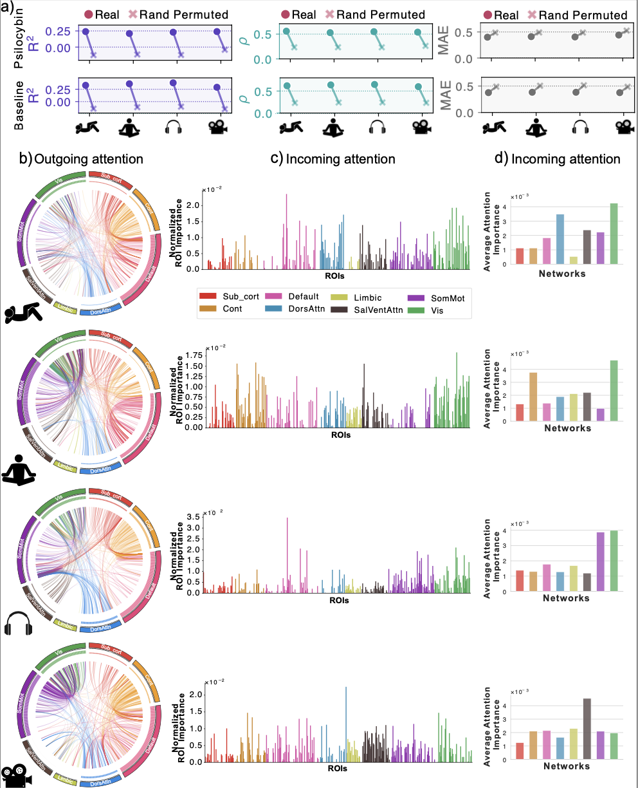

<div align="center">

# BrainSymphony  
### A Lightweight, Modular Transformer-Driven Fusion of fMRI Time Series and Structural Connectivity

</div>

> **BrainSymphony** is a **parameter-efficient multimodal foundation model** that jointly represents **fMRI time series** and **diffusion MRI–derived structural connectivity** in a unified ROI embedding space. It is designed to be **modular and plug-and-play**: you can use the fMRI pathway, the structural pathway, or both with adaptive fusion.  
>  
> Paper: *BrainSymphony: A Lightweight, Modular Transformer-Driven Fusion of fMRI Time Series and Structural Connectivity* (Khajehnejad, Habibollahi, Stoliker, Razi)

---

## Highlights

- **Multimodal by design:** parallel fMRI encoders + a **Signed Graph Transformer** for structural connectomes, fused by an **adaptive gating** mechanism.  
- **Efficient, not over-scaled:** BrainSymphony (fusion) achieves top benchmark performance with **~5.6M parameters**, far fewer than much larger neuroimaging foundation models. 
- **Interpretable mechanisms:** attention maps provide directed, network-level signatures that reveal **drug-induced, context-dependent reorganization** in an external psilocybin dataset.

---

## Architecture (at a glance)

BrainSymphony contains:

1) **Spatio–Temporal fMRI encoder**  
   - **Spatial Transformer**: models inter-regional dependencies (ROI-wise attention)  
   - **Temporal Transformer**: models neural dynamics across time  
   - **1D-CNN context extractor**: captures local temporal patterns  
   These streams are distilled into compact latents by a **Perceiver** module.

2) **Structural encoder (dMRI-SC)**  
   - **Signed Graph Transformer** encoding the weighted structural connectome.

3) **Adaptive fusion gate**  
   - Dynamically weights functional vs. structural embeddings per task.

<p align="center">
  <a href="assets/Figure_1.pdf">
    
  </a>
</p>

---

## Key results

### State-of-the-art performance with orders-of-magnitude fewer parameters
Across HCP-Aging benchmarks, BrainSymphony’s multimodal fusion variant outperforms strong baselines while remaining compact (5.6M params).

<p align="center">
  
</p>


### External validation + interpretability on psilocybin (PsiConnect)
Without any psychedelic training, BrainSymphony reconstructs held-out ROI time series on PsiConnect dataset and yields interpretable attention/influence patterns that reveal context-dependent drug effects.

<p align="center">
  <a href="assets/fig4_psiconnect_attention.pdf">
    
  </a>
</p>


<p align="center">
  
</p>


---

## What’s in this repository

- `brainsymphony/` — model components (fMRI encoders, Perceiver fusion, Signed Graph Transformer, fusion gate)
- `configs/` — training and evaluation configs
- `scripts/` — data prep, pretraining, finetuning, evaluation
- `notebooks/` — examples and reproductions
- `assets/` — README figures

> This README is intentionally minimal and paper-focused for the initial release.  
> “Running / training / checkpoints” instructions will be added as the codebase is finalized.

---

## Data and preprocessing (important)

BrainSymphony expects **ROI-parcellated fMRI** and (optionally) **ROI-aligned structural connectivity**:

- fMRI should be robustly scaled per ROI (median-centered, divided by IQR) and use the same 450-ROI ordering:
  - 1–50: Tian-Scale III subcortex  
  - 51–250: Schaefer-400 left hemisphere  
  - 251–450: Schaefer-400 right hemisphere:
- Structural connectivity: streamline counts normalized by ROI volume, log10-transformed, aggregated to the same 450-ROI parcellation.

---

## Citation

If you use BrainSymphony in academic work, please cite:

```bibtex
@article{khajehnejad2025brainsymphony,
  title={BrainSymphony: A Transformer-Driven Fusion of fMRI Time Series and Structural Connectivity},
  author={Khajehnejad, Moein and Habibollahi, Forough and Razi, Adeel},
  journal={arXiv preprint arXiv:2506.18314},
  year={2025}
}
