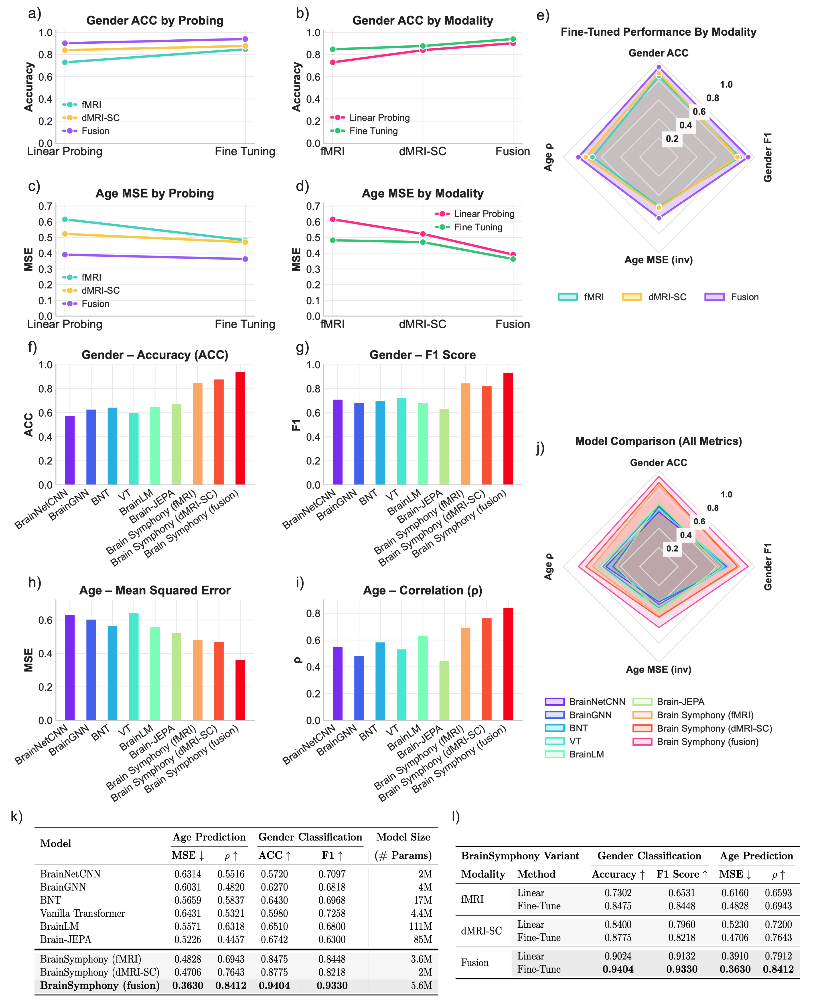

<div align="center">

# BrainSymphony  
### A Lightweight, Modular Transformer-Driven Fusion of fMRI Time Series and Structural Connectivity

</div>

> **BrainSymphony** is a **parameter-efficient multimodal foundation model** that jointly represents **fMRI time series** and **diffusion MRI–derived structural connectivity** in a unified ROI embedding space. It is designed to be **modular and plug-and-play**: you can use the fMRI pathway, the structural pathway, or both with adaptive fusion.  
>  
> Paper: *BrainSymphony: A Lightweight, Modular Transformer-Driven Fusion of fMRI Time Series and Structural Connectivity* (Khajehnejad, Habibollahi, Stoliker, Razi)

---

## Highlights

- **Multimodal by design:** parallel fMRI encoders + a **Signed Graph Transformer** for structural connectomes, fused by an **adaptive gating** mechanism.  
- **Efficient, not over-scaled:** BrainSymphony (fusion) achieves top benchmark performance with **~5.6M parameters**, far fewer than much larger neuroimaging foundation models. 
- **Interpretable mechanisms:** attention maps provide directed, network-level signatures that reveal **drug-induced, context-dependent reorganization** in an external psilocybin dataset.

---

## Architecture (at a glance)

BrainSymphony contains:

1) **Spatio–Temporal fMRI encoder**  
   - **Spatial Transformer**: models inter-regional dependencies (ROI-wise attention)  
   - **Temporal Transformer**: models neural dynamics across time  
   - **1D-CNN context extractor**: captures local temporal patterns  
   These streams are distilled into compact latents by a **Perceiver** module.

2) **Structural encoder (dMRI-SC)**  
   - **Signed Graph Transformer** encoding the weighted structural connectome.

3) **Adaptive fusion gate**  
   - Dynamically weights functional vs. structural embeddings per task.

<p align="center">
  <a href="assets/Figure_1.pdf">Figure 1 (Architecture) — PDF</a>
</p>

---

## Key results

### State-of-the-art performance with orders-of-magnitude fewer parameters
Across HCP-Aging benchmarks, BrainSymphony’s multimodal fusion variant outperforms strong baselines while remaining compact (5.6M params).

<p align="center">
  
</p>


### External validation + interpretability on psilocybin (PsiConnect)
Without any psychedelic training, BrainSymphony reconstructs held-out ROI time series on PsiConnect dataset and yields interpretable attention/influence patterns that reveal context-dependent drug effects.

<p align="center">
  <a href="assets/fig4_psiconnect_attention.pdf">Figure 4 (PsiConnect) — PDF</a>
</p>


<p align="center">
  
</p>


---

## Repository Structure

- `models/`: Contains the core architecture (Spatial/Temporal Transformers, Perceiver, Graph Transformer).
- `data/`: Data loading utilities.
- `utils/`: Masking and visualization tools.
- `train.py`: Main training script for self-supervised pretraining.

## Installation

```python
pip install -r requirements.txt
```
---
## Usage

### 1. Pretrain Functional Branch (fMRI)
To pretrain the Spatio-Temporal Transformer and Perceiver module using fMRI BOLD time series:

```python
 train.py --mode functional \
    --fmri_path ./data/hcp_fmri.pt \
    --gm_path ./data/gradients.pt \
    --epochs 100 \
    --batch_size 16 \
    --lr 1e-4 \
    --save_dir ./checkpoints/functional
```
#### Arguments:

-- fmri_path: Path to the .pt file containing the tensor of shape (N_subjects, N_ROIs, Time_steps).

-- gm_path: (Optional) Path to gradient maps for Gradient-Informed Positional Encoding.
### 2. Pretrain Structural Branch (SC)
To pretrain the Signed Graph Transformer using diffusion-derived structural connectivity matrices:

```python
 train.py --mode structural \
    --sc_path ./data/hcp_sc.pt \
    --epochs 100 \
    --batch_size 16 \
    --lr 1e-4 \
    --save_dir ./checkpoints/structural
```
#### Arguments:

-- sc_path: Path to the .pt file containing adjacency matrices of shape (N_subjects, N_ROIs, N_ROIs).

-- attention_type: Choices are first_hop, multi_hop, or diffusion (default: first_hop).

### 3. Multimodal Fusion & Downstream Tasks
Once the branches are pretrained, you can load the weights into the unified BrainSymphony model for fine-tuning or linear probing on downstream tasks (e.g., classification, regression).
from models import BrainSymphony
import torch

```python
# Configuration matching your pretrained parameters
config = {
    'mode': 'multimodal',
    'rois': 450,
    'dim': 128,
    'time_steps': 200,
    'num_layers': 6,
    'num_heads': 4,
    'mlp_dim': 512,
    'num_layers_struct': 6,
    'num_heads_struct': 4
}

# Initialize Full Model
model = BrainSymphony(config)

# Load Pretrained Weights (Optional helper method to be implemented or manual load)
model.functional_module.load_state_dict(torch.load('./checkpoints/functional/epoch_100.pth'))
model.structural_module.encoder.load_state_dict(torch.load('./checkpoints/structural/epoch_100.pth'))

# Forward Pass
# batch is a dictionary containing 'fmri', 'sc_adj', 'sc_feats'
outputs = model(batch)

fused_embedding = outputs['fused_embeds'] # (B, ROIs, Dim)
# Apply downstream classifier on fused_embedding
```
---
## Data and preprocessing (important)

BrainSymphony expects **ROI-parcellated fMRI** and (optionally) **ROI-aligned structural connectivity**:

- fMRI should be robustly scaled per ROI (median-centered, divided by IQR) and use the same 450-ROI ordering:
  - 1–50: Tian-Scale III subcortex  
  - 51–250: Schaefer-400 left hemisphere  
  - 251–450: Schaefer-400 right hemisphere:
- Structural connectivity: streamline counts normalized by ROI volume, log10-transformed, aggregated to the same 450-ROI parcellation.

---

## Citation

If you use BrainSymphony in academic work, please cite:

```bibtex
@article{khajehnejad2025brainsymphony,
  title={BrainSymphony: A Transformer-Driven Fusion of fMRI Time Series and Structural Connectivity},
  author={Khajehnejad, Moein and Habibollahi, Forough and Razi, Adeel},
  journal={arXiv preprint arXiv:2506.18314},
  year={2025}
}
